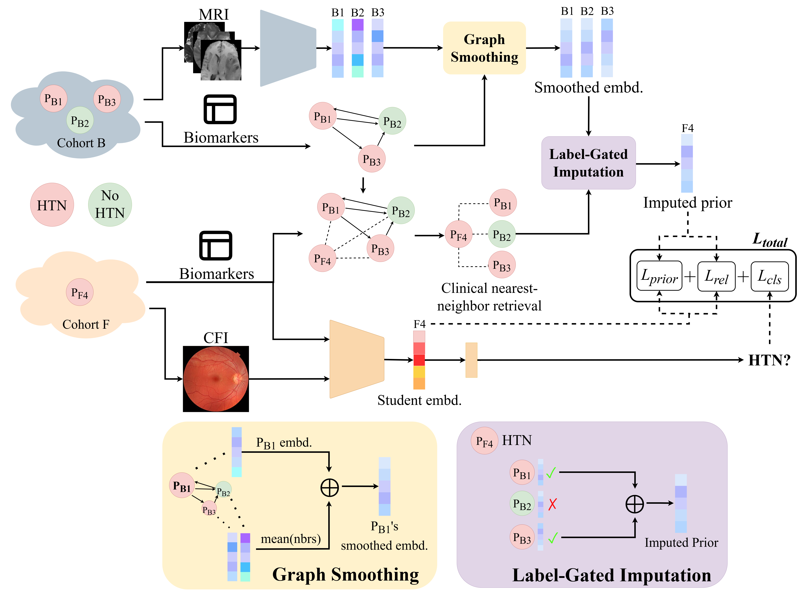

# Clinical Graph-Mediated Distillation for Unpaired MRI-to-CFI Hypertension Prediction

<p align="center">
  
</p>

This repository contains the code for the CGMD project accompanying our current arXiv/conference submission. The purpose of this release is to provide the core implementation used in the paper. This is a research code release for transparency and reference, and is not intended to be a fully packaged end-to-end reproduction repository. 

Paper Link: to be filled later.

## Overview

The codebase is organized as a staged pipeline:

1. Brain teacher training
2. Brain embedding export
3. Clinical graph construction
4. Brain-prior imputation
5. Confidence measure (unused in main method)
6. Final fundus student training with clinical features, prior distillation, and relational KD

The main configuration file is:

- `configs/cgmd_run.yaml`

## Main Entry Points

- `scripts_and_bash/train_brain_phase1_2d.py`
- `inference_and_export/export_brain_teacher_embeddings_2d.py`
- `inference_and_export/build_clinical_knn_graph.py`
- `scripts_and_bash/phase3_train_imputer_upgraded.py`
- `scripts_and_bash/phase4_compute_confidence.py` (unused in main method)
- `scripts_and_bash/phase5_train_fundus_student_upgraded_pushpull.py`

## Example Usage

The pipeline is driven through the unified config:

```bash
python -m scripts_and_bash.train_brain_phase1_2d --config configs/cgmd_run.yaml
python -m inference_and_export.export_brain_teacher_embeddings_2d --config configs/cgmd_run.yaml
python -m inference_and_export.build_clinical_knn_graph --config configs/cgmd_run.yaml
python -m scripts_and_bash.phase3_train_imputer_upgraded --config configs/cgmd_run.yaml
python -m scripts_and_bash.phase4_compute_confidence --config configs/cgmd_run.yaml
python -m scripts_and_bash.phase5_train_fundus_student_upgraded_pushpull --config configs/cgmd_run.yaml
```

## Final CGMD Setting
For the final multimodal student setting used in the paper, the important phase-5 options are:

```bash
mode.use_clinical: true
mode.use_priors: true
mode.use_anchor: false
relational_kd.enabled: true
```

## Notes
This repository does not include the full dataset or all preprocessing assets.
Relative data paths in the config reflect the original project structure used during development.
Some scripts assume external CSV/index files are already prepared.

## Citation
If you use this code, please cite the corresponding paper with the citation below:
```bibtext
to be filled later
```
